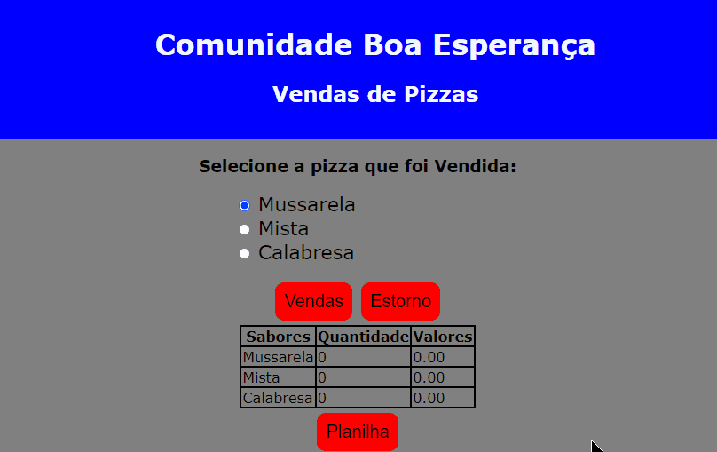

# Projeto Pizzaria em JavaScript

Um projeto feito apenas com o básico do front end. 🚀

## Sobre

Projeto em Js desenvolvido para determinar a quantidade de pizzas vendidas e seus valores, e ao final que possa baixar um arquivo em Excel com todos os dados feito pelo programa.

[
    
](https://leo-ngra.github.io/Projeto-Pizzaria-JS/)

### Tecnologias utilizadas:
- HTML
- CSS
- JavaScript

### Como utilizar:

1 - Clone o projeto na sua máquina

```
git clone https://github.com/leo-ngra/Projeto-Pizzaria-JS.git
```

2 - Acesse o arquivo 'index.html' na pasta do arquivo

3 - Após inserir as vendas, clica no botão "Planilha", e em seguida será baixado um arquivo .xlsx para mostrar em Excel a tabela com a quantidade de vendas e valores.

3 - Agora, se divirta! 😜


### Link do Projeto:

<a> https://leo-ngra.github.io/Projeto-Pizzaria-JS/ </a>

